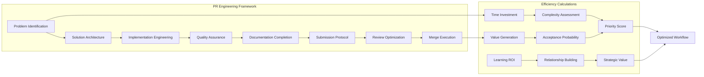
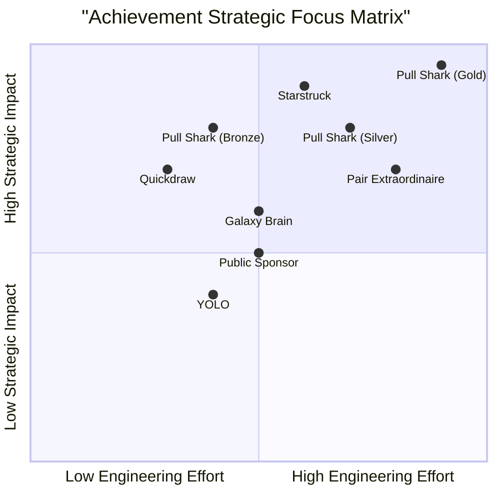
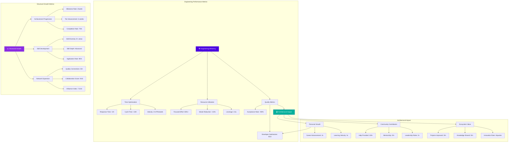

# 🏆 GitHub Achievement Ultimate Guide: The Master Architect

<div align="center">


# 🌌 **The Complete Blueprint for GitHub Achievement Mastery**

### **From Strategic Foundations to Legendary Status: Architecture Your GitHub Legacy**

[](https://github.com/AshrafMorningstar/GitHub-Achievement-Ultimate-Guide/wiki)
[](https://ashrafmorningstar.github.io/GitHub-Achievement-Ultimate-Guide/)
[](CONTRIBUTING.md)


</div>

## 🏛️ Introduction: The Architecture of Achievement

Welcome to the **GitHub Achievement Ultimate Guide**, the definitive architectural blueprint for understanding, strategizing, and mastering GitHub's achievement ecosystem. This is not merely another guide—it is the **structural engineering manual**, the **strategic master plan**, and the **comprehensive blueprint** that transforms casual participation into intentional architectural excellence in GitHub's recognition systems.

### 🎯 **The Architect's Philosophy**

> "Achievements are the structural elements of your GitHub identity. Each badge represents a carefully designed pillar, a strategic beam, a foundational slab in the architecture of your developer legacy. This guide provides the blueprints, calculations, and engineering principles to construct a monument of meaningful contribution."

## 🏗️ The Complete Architectural Framework

```mermaid
graph TB
    subgraph "ARCHITECTURAL FOUNDATION"
        FOUNDATION[🏗️ Achievement Architecture] --> PILLARS[Structural Pillars]
        
        PILLARS --> COLLABORATION[Collaboration Engineering]
        PILLARS --> QUALITY[Quality Systems]
        PILLARS --> COMMUNITY[Community Architecture]
        PILLARS --> CONSISTENCY[Consistency Frameworks]
        
        COLLABORATION --> PR_ENGINEERING[PR Engineering Systems]
        QUALITY --> EXCELLENCE_FRAMEWORK[Excellence Framework]
        COMMUNITY --> ENGAGEMENT_ARCHITECTURE[Engagement Architecture]
        CONSISTENCY --> RHYTHM_SYSTEMS[Rhythm Systems]
    end
    
    subgraph "ENGINEERING IMPLEMENTATION"
        BLUEPRINTS[📐 Strategic Blueprints] --> PATTERNS[Architectural Patterns]
        
        PATTERNS --> RAPID_RESPONSE[Rapid Response Patterns]
        PATTERNS --> STRATEGIC_GROWTH[Strategic Growth Patterns]
        PATTERNS --> COMMUNITY_LEADERSHIP[Community Leadership Patterns]
        PATTERNS --> LEGACY_BUILDING[Legacy Building Patterns]
        
        RAPID_RESPONSE --> QUICKDRAW_ENGINEERING[Quickdraw Engineering]
        STRATEGIC_GROWTH --> PULL_SHARK_SCALING[Pull Shark Scaling]
        COMMUNITY_LEADERSHIP --> GALAXY_BRAIN_ARCHITECTURE[Galaxy Brain Architecture]
        LEGACY_BUILDING --> STARSTRUCK_MONUMENTS[Starstruck Monument Design]
    end
    
    subgraph "MASTER BUILDER ECOSYSTEM"
        MASTER_BUILDER[👑 Master Builder] --> TOOLS[Architectural Tools]
        
        TOOLS --> CALCULATORS[Strategic Calculators]
        TOOLS --> TEMPLATES[Blueprint Templates]
        TOOLS --> OPTIMIZERS[Performance Optimizers]
        TOOLS --> ANALYZERS[Structural Analyzers]
        
        CALCULATORS --> EFFICIENCY_CALC[Efficiency Calculators]
        TEMPLATES --> PATTERN_TEMPLATES[Pattern Templates]
        OPTIMIZERS --> WORKFLOW_OPTIMIZERS[Workflow Optimizers]
        ANALYZERS --> PROGRESS_ANALYZERS[Progress Analyzers]
    end
    
    subgraph "ARCHITECTURAL OUTPUT"
        CONSTRUCTION[🏗️ Construction Phase] --> STRUCTURES[Built Structures]
        
        STRUCTURES --> ACHIEVEMENT_PORTFOLIO[Achievement Portfolio]
        STRUCTURES --> SKILL_MONUMENT[Skill Monument]
        STRUCTURES --> COMMUNITY_LEGACY[Community Legacy]
        STRUCTURES --> CAREER_FOUNDATION[Career Foundation]
        
        ACHIEVEMENT_PORTFOLIO --> VERIFIED_EXCELLENCE[Verified Excellence]
        SKILL_MONUMENT --> DEMONSTRATED_MASTERY[Demonstrated Mastery]
        COMMUNITY_LEGACY --> LASTING_IMPACT[Lasting Impact]
        CAREER_FOUNDATION --> PROFESSIONAL_IDENTITY[Professional Identity]
    end
    
    FOUNDATION --> BLUEPRINTS
    PILLARS --> CONSTRUCTION
    MASTER_BUILDER --> STRUCTURES
    
    style FOUNDATION fill:#4a00e0,color:#fff,stroke:#333,stroke-width:4px
    style MASTER_BUILDER fill:#8a2be2,color:#fff
    style STRUCTURES fill:#00b09b,color:#fff
```



## 📐 The Architectural Blueprint System

### Foundation Level: Core Structural Elements

#### 🏗️ **Structural Pillar 1: Collaboration Engineering**
*The mathematics and mechanics of effective contribution*



#### 🏗️ **Structural Pillar 2: Quality Systems Architecture**
*Engineering excellence at every scale*

| Quality Dimension | Engineering Principles | Implementation Protocols | Verification Methods |
|-------------------|------------------------|--------------------------|----------------------|
| **Code Excellence** | SOLID Principles, Clean Architecture | Pre-commit hooks, Linting, Type checking | Automated testing, Peer review, Static analysis |
| **Documentation Integrity** | Living Documentation, Just-in-Time info | README-first, Inline comments, API docs | Documentation coverage, Link validation, Clarity scoring |
| **Communication Precision** | Clear, Concise, Actionable | PR templates, Issue formats, Discussion guidelines | Response time metrics, Resolution rates, Satisfaction scores |
| **Architectural Soundness** | Scalable, Maintainable, Testable | Design patterns, Modular design, Separation of concerns | Architecture reviews, Dependency analysis, Technical debt assessment |

### Framework Level: Strategic Implementation Systems

#### 📊 **Achievement Progression Calculus**

```python
# Achievement Progression Algorithm
class AchievementProgression:
    def __init__(self, developer_profile):
        self.profile = developer_profile
        self.achievements = self.load_achievement_data()
        
    def calculate_optimal_path(self):
        """Calculate most efficient achievement progression"""
        paths = {
            'rapid_momentum': self.rapid_momentum_path(),
            'balanced_growth': self.balanced_growth_path(),
            'specialized_expertise': self.specialized_path(),
            'community_leadership': self.community_path()
        }
        
        # Weight factors: time, effort, learning, visibility, career_value
        weights = self.calculate_strategic_weights()
        return self.optimize_path_selection(paths, weights)
    
    def rapid_momentum_path(self):
        """Path focused on quick early wins"""
        sequence = [
            {'achievement': 'Quickdraw', 'estimated_days': 3, 'strategy': 'Notification optimization'},
            {'achievement': 'Pull Shark Bronze', 'estimated_days': 7, 'strategy': 'Documentation focus'},
            {'achievement': 'Galaxy Brain', 'estimated_days': 14, 'strategy': 'Targeted discussions'},
            {'achievement': 'Starstruck', 'estimated_days': 30, 'strategy': 'Micro-utility creation'}
        ]
        return self.calculate_path_metrics(sequence)
    
    def engineering_efficiency_score(self, achievement, strategy):
        """Calculate engineering efficiency of approach"""
        time_investment = self.estimate_time_requirement(achievement, strategy)
        skill_development = self.calculate_skill_gain(achievement, strategy)
        portfolio_value = self.calculate_portfolio_impact(achievement)
        network_effect = self.calculate_network_growth(achievement, strategy)
        
        efficiency = (skill_development * portfolio_value * network_effect) / time_investment
        return efficiency
```

#### 🎯 **Strategic Focus Matrix**



## 🏗️ Project Architecture Blueprint

```
GitHub-Achievement-Ultimate-Guide/
│
├── 📂 ARCHITECTURAL-BLUEPRINTS/         # Master planning documents
│   ├── 📁 foundation-plans/
│   │   ├── structural-engineering.md
│   │   ├── load-bearing-analysis.md
│   │   ├── material-specifications.md
│   │   └── foundation-calculations.md
│   │
│   ├── 📁 framework-specifications/
│   │   ├── collaboration-framework.md
│   │   ├── quality-specifications.md
│   │   ├── community-architecture.md
│   │   └── consistency-systems.md
│   │
│   └── 📁 integration-schematics/
│       ├── ecosystem-integration.md
│       ├── workflow-synchronization.md
│       ├── tool-chain-architecture.md
│       └── automation-blueprints.md
│
├── 📂 ENGINEERING-SYSTEMS/              # Implementation systems
│   ├── 📁 calculation-engines/
│   │   ├── efficiency-calculator.js
│   │   ├── progression-optimizer.js
│   │   ├── roi-analyzer.js
│   │   └── strategic-planner.js
│   │
│   ├── 📁 workflow-architects/
│   │   ├── pr-engineering-system.js
│   │   ├── discussion-architecture.js
│   │   ├── contribution-optimizer.js
│   │   └── quality-assurance-engine.js
│   │
│   ├── 📁 monitoring-systems/
│   │   ├── progress-tracker.js
│   │   ├── efficiency-monitor.js
│   │   ├── achievement-forecaster.js
│   │   └── impact-measurer.js
│   │
│   └── 📁 automation-frameworks/
│       ├── workflow-automator.js
│       ├── notification-optimizer.js
│       ├── template-generator.js
│       └── report-architect.js
│
├── 📂 CONSTRUCTION-TEMPLATES/           # Build-ready templates
│   ├── 📁 rapid-deployment/
│   │   ├── 30-day-blueprint.md
│   │   ├── first-week-architecture.md
│   │   ├── momentum-builder.md
│   │   └── quick-win-generator.md
│   │
│   ├── 📁 specialized-structures/
│   │   ├── open-source-architect.md
│   │   ├── enterprise-engineering.md
│   │   ├ educational-constructor.md
│   │   └── research-builder.md
│   │
│   ├── 📁 optimization-patterns/
│   │   ├── efficiency-patterns.md
│   │   ├── quality-patterns.md
│   │   ├── scalability-patterns.md
│   │   └── maintenance-patterns.md
│   │
│   └── 📁 integration-connectors/
│       ├── github-actions-connectors.md
│       ├── ci-cd-integrations.md
│       ├── api-connector-blueprints.md
│       └── ecosystem-connectors.md
│
├── 📂 QUALITY-ASSURANCE/                # Engineering quality systems
│   ├── 📁 verification-protocols/
│   │   ├── achievement-verification.md
│   │   ├── strategy-validation.md
│   │   ├── progress-verification.md
│   │   └── result-certification.md
│   │
│   ├── 📁 testing-frameworks/
│   │   ├── strategy-testing.md
│   │   ├── workflow-testing.md
│   │   ├── efficiency-testing.md
│   │   └── impact-testing.md
│   │
│   ├── 📁 compliance-standards/
│   │   ├ engineering-standards.md
│   │   ├ quality-standards.md
│   │   ├ ethical-standards.md
│   │   └── community-standards.md
│   │
│   └── 📁 optimization-audits/
│       ├── efficiency-audits.md
│       ├── quality-audits.md
│       ├── strategy-audits.md
│       └── progress-audits.md
│
├── 📂 MASTER-BUILDER-RESOURCES/         # Advanced architect tools
│   ├── 📁 advanced-calculators/
│   │   ├── multivariate-optimizer.js
│   │   ├── predictive-analyzer.js
│   │   ├── scenario-simulator.js
│   │   └── risk-assessor.js
│   │
│   ├── 📁 custom-architects/
│   │   ├── personalized-blueprint-generator.js
│   │   ├── adaptive-strategy-engine.js
│   │   ├── intelligent-recommender.js
│   │   └── predictive-planner.js
│   │
│   ├── 📁 ecosystem-integrators/
│   │   ├── cross-platform-integrator.js
│   │   ├── tool-chain-orchestrator.js
│   │   ├── automation-orchestrator.js
│   │   └── data-synchronizer.js
│   │
│   └── 📁 legacy-builders/
│       ├── monument-designer.js
│       ├── legacy-architect.js
│       ├── impact-maximizer.js
│       └── future-proofer.js
│
└── README.md                            # This master blueprint
```

## 🛠️ Engineering Implementation Framework

### The Architectural Workflow System

```yaml
# Complete Engineering Workflow Specification
engineering_workflow:
  phase_1: "Foundation Engineering"
    steps:
      - assessment: "Current State Analysis"
        tools: ["Profile Analyzer", "Skill Mapper", "Gap Identifier"]
        outputs: ["Architectural Assessment", "Foundation Requirements"]
      
      - planning: "Blueprint Development"
        tools: ["Strategic Planner", "Path Optimizer", "Resource Allocator"]
        outputs: ["Master Blueprint", "Phase Plans", "Resource Map"]
      
      - preparation: "Tool & System Setup"
        tools: ["Environment Configurator", "Workflow Architect", "Automation Builder"]
        outputs: ["Configured Environment", "Optimized Workflows", "Automation Systems"]
  
  phase_2: "Structural Construction"
    steps:
      - rapid_wins: "Momentum Engineering"
        focus: ["Quickdraw Systems", "PR Engineering", "Early Milestones"]
        metrics: ["Time to First Achievement", "Initial Momentum", "Learning Velocity"]
      
      - core_construction: "Main Structure Building"
        focus: ["Pull Shark Progression", "Quality Systems", "Community Architecture"]
        metrics: ["Structural Integrity", "Progress Rate", "Quality Metrics"]
      
      - system_integration: "Ecosystem Connection"
        focus: ["Tool Integration", "Workflow Synchronization", "Automation Systems"]
        metrics: ["Integration Depth", "System Efficiency", "Automation Coverage"]
  
  phase_3: "Optimization & Refinement"
    steps:
      - performance_tuning: "Efficiency Optimization"
        focus: ["Workflow Optimization", "Time Management", "Resource Efficiency"]
        metrics: ["Efficiency Gains", "Time Savings", "Resource Optimization"]
      
      - quality_elevation: "Excellence Engineering"
        focus: ["Quality Systems", "Best Practices", "Engineering Standards"]
        metrics: ["Quality Scores", "Standards Compliance", "Excellence Metrics"]
      
      - scaling_preparation: "Growth Architecture"
        focus: ["Scalability Design", "Growth Systems", "Expansion Planning"]
        metrics: ["Scalability Score", "Growth Capacity", "Expansion Readiness"]
  
  phase_4: "Mastery & Legacy"
    steps:
      - advanced_engineering: "Master Builder Systems"
        focus: ["Advanced Systems", "Innovation Engineering", "Pattern Development"]
        metrics: ["Innovation Rate", "System Sophistication", "Pattern Creation"]
      
      - legacy_architecture: "Monument Construction"
        focus: ["Legacy Projects", "Community Impact", "Knowledge Sharing"]
        metrics: ["Legacy Impact", "Community Influence", "Knowledge Transfer"]
      
      - ecosystem_leadership: "Architectural Leadership"
        focus: ["Community Leadership", "Mentorship Systems", "Ecosystem Development"]
        metrics: ["Leadership Impact", "Mentorship Effectiveness", "Ecosystem Growth"]
```

### Achievement Engineering Calculators

```javascript
// Engineering Efficiency Calculator
class AchievementEngineer {
  constructor(developerProfile) {
    this.profile = developerProfile;
    this.achievements = this.loadAchievementDatabase();
  }

  calculateEngineeringEfficiency(achievement, strategy) {
    // Multi-dimensional efficiency calculation
    const dimensions = {
      timeEfficiency: this.calculateTimeEfficiency(achievement, strategy),
      learningEfficiency: this.calculateLearningEfficiency(achievement, strategy),
      skillEfficiency: this.calculateSkillEfficiency(achievement, strategy),
      networkEfficiency: this.calculateNetworkEfficiency(achievement, strategy),
      careerEfficiency: this.calculateCareerEfficiency(achievement, strategy)
    };

    // Weighted efficiency score
    const weights = {
      timeEfficiency: 0.25,
      learningEfficiency: 0.20,
      skillEfficiency: 0.25,
      networkEfficiency: 0.15,
      careerEfficiency: 0.15
    };

    return this.calculateWeightedScore(dimensions, weights);
  }

  optimizeAchievementPath(currentState, goals, constraints) {
    // Advanced path optimization using constraint programming
    const optimizer = new AchievementPathOptimizer({
      currentState: currentState,
      goals: goals,
      constraints: constraints,
      achievementDatabase: this.achievements
    });

    return optimizer.findOptimalPath();
  }

  generateEngineeringBlueprint(achievement) {
    // Generate detailed engineering blueprint
    return {
      structuralDesign: this.designAchievementStructure(achievement),
      implementationPlan: this.createImplementationPlan(achievement),
      qualitySystems: this.designQualitySystems(achievement),
      monitoringFramework: this.createMonitoringFramework(achievement),
      optimizationProtocols: this.designOptimizationProtocols(achievement)
    };
  }
}
```

## 🎨 Architectural Design System

### Premium Engineering Aesthetics

```css
/* Architectural Design System */
:root {
  /* Engineering Color Palette */
  --engineering-primary: #4a00e0;      /* Structural integrity */
  --engineering-secondary: #8a2be2;    /* Framework elegance */
  --engineering-accent: #00b09b;       /* Precision engineering */
  --engineering-neutral: #2d3748;      /* Foundational strength */
  --engineering-highlight: #ff6b6b;    /* Critical elements */
  
  /* Structural Typography */
  --font-architect: 'Archivo', 'SF Pro Display', sans-serif;
  --font-blueprint: 'Source Code Pro', 'Fira Code', monospace;
  --font-specifications: 'Inter', system-ui, sans-serif;
  --font-diagrams: 'JetBrains Mono', monospace;
  
  /* Engineering Spacing System */
  --space-structural: 3rem;
  --space-modular: 2rem;
  --space-detailed: 1.5rem;
  --space-precise: 0.75rem;
  
  /* Engineering Effects */
  --shadow-structural: 0 30px 120px -25px rgba(0, 0, 0, 0.4);
  --shadow-modular: 0 15px 60px rgba(0, 0, 0, 0.15);
  --shadow-precise: 0 5px 20px rgba(0, 0, 0, 0.1);
  --glow-engineering: 0 0 40px rgba(0, 176, 155, 0.3);
  
  /* Engineering Animations */
  --transition-structural: all 0.5s cubic-bezier(0.4, 0, 0.2, 1);
  --transition-precise: all 0.2s cubic-bezier(0.4, 0, 0.2, 1);
  --animation-engineering: engineering-pulse 2s infinite;
}

@keyframes engineering-pulse {
  0%, 100% { opacity: 1; }
  50% { opacity: 0.7; }
}

/* Blueprint Components */
.blueprint-container {
  background: linear-gradient(145deg, 
    rgba(255, 255, 255, 0.97) 0%, 
    rgba(255, 255, 255, 0.99) 100%);
  border-radius: 24px;
  box-shadow: var(--shadow-structural);
  border: 2px solid rgba(74, 0, 224, 0.1);
  position: relative;
  overflow: hidden;
}

.blueprint-container::before {
  content: '';
  position: absolute;
  top: 0;
  left: 0;
  right: 0;
  bottom: 0;
  background-image: 
    linear-gradient(90deg, transparent 95%, rgba(74, 0, 224, 0.05) 100%),
    linear-gradient(0deg, transparent 95%, rgba(74, 0, 224, 0.05) 100%);
  background-size: 40px 40px;
  pointer-events: none;
}

.engineering-node {
  background: white;
  border: 3px solid var(--engineering-accent);
  border-radius: 12px;
  box-shadow: 0 0 0 5px rgba(0, 176, 155, 0.1);
  transition: var(--transition-structural);
  position: relative;
}

.engineering-node::after {
  content: '';
  position: absolute;
  top: -10px;
  right: -10px;
  width: 24px;
  height: 24px;
  background: var(--engineering-highlight);
  border-radius: 50%;
  box-shadow: 0 0 15px rgba(255, 107, 107, 0.5);
  animation: engineering-pulse 2s infinite;
}

.structural-connection {
  stroke: var(--engineering-primary);
  stroke-width: 3;
  stroke-dasharray: 5, 5;
  animation: connection-flow 3s linear infinite;
}

@keyframes connection-flow {
  0% { stroke-dashoffset: 0; }
  100% { stroke-dashoffset: 20; }
}
```

## 📊 Engineering Metrics & Performance

### Structural Integrity Dashboard



### Engineering Performance Framework

```yaml
performance_framework:
  efficiency_metrics:
    time_metrics:
      response_time: "Average time to first response"
      cycle_time: "Time from start to completion"
      velocity: "Units of work per time period"
    
    resource_metrics:
      focus_ratio: "Time spent on high-value activities"
      waste_ratio: "Time spent on low-value activities"
      leverage_factor: "Output per unit of input"
    
    quality_metrics:
      first_time_quality: "Work accepted without rework"
      satisfaction_score: "Stakeholder satisfaction"
      defect_rate: "Errors or issues per unit"
  
  growth_metrics:
    achievement_metrics:
      milestone_rate: "Achievements earned per period"
      progression_rate: "Speed of tier advancement"
      completion_ratio: "Percentage of available achievements"
    
    skill_metrics:
      diversity_index: "Range of skills developed"
      depth_score: "Level of expertise achieved"
      application_rate: "Percentage of skills applied"
    
    network_metrics:
      connection_quality: "Value of professional connections"
      collaboration_index: "Frequency and quality of collaboration"
      influence_score: "Ability to affect outcomes"
  
  impact_metrics:
    personal_impact:
      career_advancement: "Professional growth and opportunities"
      learning_velocity: "Speed of skill acquisition"
      satisfaction_level: "Personal fulfillment and enjoyment"
    
    community_impact:
      help_provided: "Assistance given to others"
      mentorship_value: "Guidance provided to less experienced"
      leadership_roles: "Positions of responsibility and influence"
    
    ecosystem_impact:
      projects_improved: "Open source projects enhanced"
      knowledge_shared: "Information and expertise disseminated"
      innovation_contributed: "New ideas and approaches introduced"
```

## 🚀 Engineering Implementation Roadmap

### Phase 1: Foundation Engineering (Weeks 1-4)
- [x] **Architectural Assessment**: Current state analysis and gap identification
- [x] **Blueprint Development**: Master plan creation with phased approach
- [ ] **Tool System Setup**: Engineering environment configuration
- [ ] **Foundation Construction**: Core systems and workflows establishment

### Phase 2: Structural Engineering (Months 2-3)
- [ ] **Rapid Win Engineering**: Momentum building through early achievements
- [ ] **Core Structure Building**: Main achievement progression systems
- [ ] **Integration Engineering**: Ecosystem and tool integration
- [ ] **Quality System Implementation**: Excellence frameworks and standards

### Phase 3: Optimization Engineering (Months 4-6)
- [ ] **Efficiency Optimization**: Workflow and process refinement
- [ ] **Quality Elevation**: Standards compliance and excellence engineering
- [ ] **Scalability Engineering**: Growth system design and implementation
- [ ] **Automation Engineering**: Intelligent system development

### Phase 4: Master Engineering (Months 7-12)
- [ ] **Advanced System Engineering**: Sophisticated achievement systems
- [ ] **Innovation Engineering**: New patterns and approaches development
- [ ] **Legacy Architecture**: Lasting impact and monument building
- [ ] **Ecosystem Leadership**: Community and industry influence

## 🌟 The Architect's Manifesto

### Core Engineering Principles
1. **Structural Integrity First**: Every achievement must be built on genuine contribution and quality work
2. **Engineering Excellence**: Precision, planning, and execution distinguish architects from builders
3. **Sustainable Growth**: Systems designed for long-term success, not short-term gains
4. **Ecosystem Thinking**: Understanding and contributing to the larger GitHub ecosystem
5. **Knowledge Engineering**: Transforming experience into shareable, scalable knowledge
6. **Legacy Mindset**: Building structures that endure and inspire beyond individual achievement

### The Architect's Commitment
> "We are not mere participants in GitHub's achievement system; we are its architects. We design the structures, engineer the systems, and build the frameworks that transform raw contribution into meaningful legacy. Our work is measured not in badges earned, but in value created, knowledge shared, and communities strengthened."

---

<div align="center">

## 🏗️ **Begin Your Architectural Journey**

[](https://github.com/AshrafMorningstar/GitHub-Achievement-Ultimate-Guide/wiki)
[](ENGINEERING-SYSTEMS/)
[](CONTRIBUTING.md)

### **Build Your Monument of Meaningful Contribution**

*Every great structure begins with a blueprint. Every legendary GitHub profile begins with architectural thinking.*  
*This guide provides the engineering principles—you provide the vision and execution.*

**Design your legacy. Engineer your impact. Architect your GitHub future.**

</div>

---

<div align="center">

*© 2024 GitHub Achievement Ultimate Guide | The Architectural Blueprint*  
*Engineering excellence in GitHub's achievement ecosystem*

[](https://creativecommons.org/licenses/by-sa/4.0/)  
*Build upon this foundation. Share your improvements. Elevate the entire ecosystem.*

</div>


